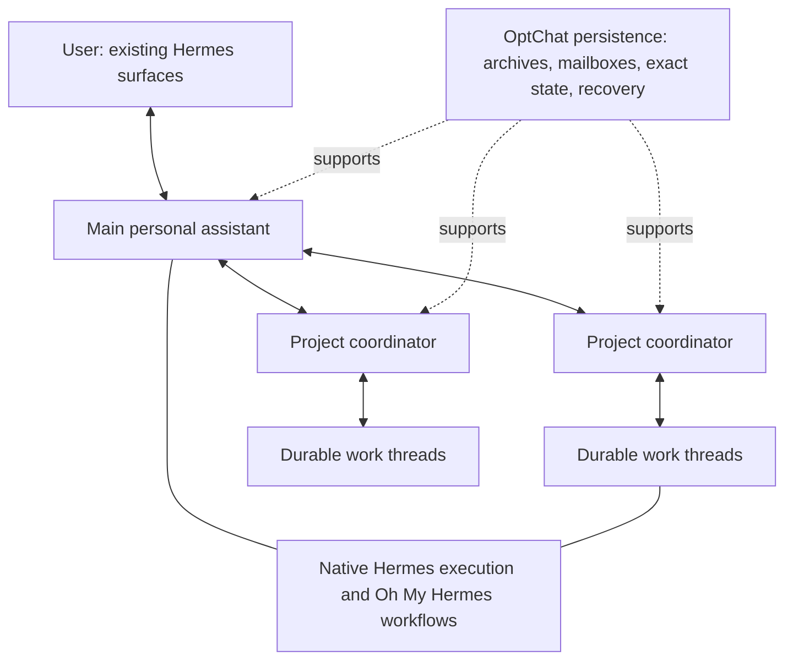

# OptChat for Hermes

[](https://github.com/edigeh/optchat-hermes/actions/workflows/repository-checks.yml)
[](LICENSE)

An enduring personal-assistant layer for [Hermes Agent](https://github.com/NousResearch/hermes-agent), built around [Oh My Hermes](https://github.com/rlaope/oh-my-hermes).

This repository publishes the architecture specification and portable memory contract for OptChat for Hermes. The design gives one personal assistant durable history and independently resumable projects while preserving native Hermes execution and OMH workflows.



## Start here

- [Architecture](docs/architecture.md): ownership, memory, projects, compatibility, deployment, and acceptance contracts.
- [Memory contract](docs/memory-contract.md): binary trees, exact source addresses, bounded views, import, and recovery rules.
- [Contributing](CONTRIBUTING.md): scope, checks, review, and licensing.
- [Security](SECURITY.md): private vulnerability reporting and sensitive-data handling.

## Architectural commitments

| Layer | Responsibility |
| --- | --- |
| Hermes | Authentication, chat surfaces, models, tools, MCP, approvals, skills, sessions, scheduling, and execution |
| Oh My Hermes | Workflows, planning, selected coding-executor handoffs, reviewed memory, and observed evidence |
| OptChat | Enduring personal history, exact recall, logical actors, project commitments, mailboxes, scheduling admissions, and recovery |

Retained originals remain authoritative. Binary summary trees provide a bounded historical view with exact retrieval. Personal profiles carry provenance and corrections. Project constraints and accepted results are exact structured state. A durable thread can outlive several native execution attempts, including a process restart.

The design uses a native Python plugin and a local persistence service. Participating sessions select an OptChat context engine while retaining their configured external memory provider. Existing native features continue through their owning runtime.

## Repository checks

The checks validate documentation links, repository hygiene, public artifacts, and pinned workflow dependencies:

```sh
python3 scripts/check_repository.py
```

They run with the Python standard library and require no provider credentials. Runtime acceptance is specified in [the architecture](docs/architecture.md#16-acceptance-suite).

## Community and license

Contributions follow [the contribution guide](CONTRIBUTING.md) and [code of conduct](CODE_OF_CONDUCT.md). The project is licensed under [MIT](LICENSE). Upstream projects and attribution are listed in [NOTICE.md](NOTICE.md).
