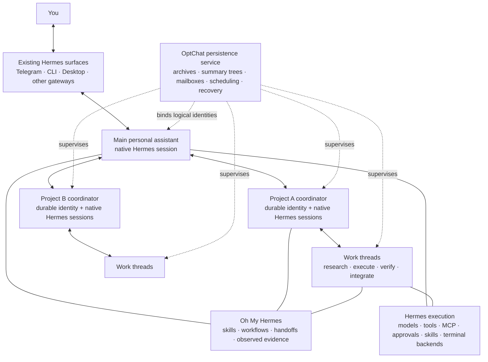

# OptChat for Hermes

Architecture design · 6 October 2026

## 1. Recommended architecture

Build **OptChat as a native Hermes plugin and a local persistence service**, with **rlaope/oh-my-hermes 3.0.0** as the workflow base. Keep talking to Hermes through its existing interfaces. Add the enduring personal relationship and project hierarchy from OptChat to the Hermes sessions behind those interfaces.

The product has one personal assistant, one continuous personal history, and many independently resumable projects. Hermes remains the agent runtime. Oh My Hermes remains the workflow and coding-handoff layer. OptChat owns the durable conversation structure, complete retained history, exact retrieval, actor mailboxes, and project commitments.

Port OptChat's memory and coordination contracts into a reusable Python core. Use Hermes for inference and execution. This keeps the deployment native to the Python harness and avoids making the OMP runtime a dependency of the Hermes assistant. The public memory contract supplies synthetic fixtures and behavioral conformance cases without requiring access to the original harness implementation.



**An enduring conversation is a logical history, not one infinitely growing provider session.** Native Hermes sessions may reset, compress, branch, or restart while their personal or project identity remains bound to its OptChat history. A fresh provider request receives a bounded view with exact retrieval available.

Small actions can stay in main. Projects serve continuing goals; threads serve bounded assignments. An idle project consumes storage and no model calls.

## 2. Design basis

This specification applies the OptChat history and actor contracts described in [the portable memory contract](memory-contract.md) to native Hermes extension surfaces.

| System | Reference baseline | Relevant contract |
| --- | --- | --- |
| OptChat memory and coordination | [Memory contract](memory-contract.md) | Complete retained originals, binary summary trees, bounded views, exact retrieval, durable actors, immutable results, and recovery. |
| Hermes Agent | `0c77988889309c510f1072bc2a818ab16e046e22` | Native plugin registration, context selection, middleware, message injection, and subagent lifecycle interfaces. |
| Oh My Hermes | `59fa5eec51579c6970ca60f9c06ebf3b87f53b54`, version 3.0.0 | Its plugin registers tools, hooks, memory-provider integration, and awareness guidance; preserve those registrations. |

Hermes supplies a [context-engine interface](https://hermes-agent.nousresearch.com/docs/developer-guide/context-engine-plugin) for replacing request context without rewriting the native transcript. Its [plugin interfaces](https://hermes-agent.nousresearch.com/docs/developer-guide/plugins) expose the surrounding integration points. Resolve immutable upstream revisions and inspect the actual host before implementation; these baselines are reference points, not a universal compatibility claim.

Three limits materially shape the design:

1. **Subagent handles are temporary execution handles.** The reference API cannot reconnect after a process restart and rejects a per-launch working-directory override. A durable OptChat thread therefore outlives, and can contain several, Hermes executions. [Native lifecycle contract](https://hermes-agent.nousresearch.com/docs/developer-guide/subagent-lifecycle-api).
2. **Context selection and completion callbacks are best effort.** The reference implementation falls back to native request context when selection fails; some abnormal endings skip completion notification. Archive integrity needs incremental capture plus reconciliation, with completion hooks acting as accelerators.
3. **The external memory-provider slot is single-select.** OptChat should not occupy it: doing so could displace OMH or the user's selected provider. Keep native memory active and implement historical recall through the context engine and ordinary plugin tools. [Memory-provider contract](https://hermes-agent.nousresearch.com/docs/developer-guide/memory-provider-plugin).

The document describes the target integration. Behavioral compatibility is established by the acceptance suite in section 16.

## 3. Ownership boundaries

| Owner | Responsibility | Boundary |
| --- | --- | --- |
| Hermes | Authentication, channel intake, agent loop, providers, tools, approvals, skills, native sessions, cron, workspaces | Every model request and external action uses the native execution path. |
| Oh My Hermes | Workflow selection, planning and coding handoff contracts, reviewed memory, observed workflow evidence | Preserve its distinction between prepared intent and observed execution. |
| OptChat core | Logical actors, retained archives, binary trees, exact current project state, mailboxes, admissions, recovery | Does not implement another provider adapter, shell tool, approval system, or messaging bot. |
| Main assistant | Your personal relationship, priorities, project creation, cross-project decisions | Passes the authorized objective and constraints into each project. |
| Project coordinator | One project's plan, dependencies, assignments, acceptance, integration, and reporting | Can manage its own project; cannot widen the user's authorization. |
| Thread | One assignment, its actions and evidence | Produces an immutable result; cannot declare its parent project complete. |

OMH's ownership split and observation rules remain the integration contract. Its coding handoffs name the selected executor; a prepared handoff alone proves no execution. Keep personal transcripts in the private OptChat archive; OMH receives bounded eligible context, source references, and metadata/evidence receipts through its existing contracts. [Pinned OMH architecture](https://github.com/rlaope/oh-my-hermes/blob/59fa5eec51579c6970ca60f9c06ebf3b87f53b54/docs/ARCHITECTURE.md).

## 4. One personal identity across surfaces

Introduce an explicit `Principal` registry. The initial principal is you. Bind authenticated Telegram, local CLI, and any later authenticated surfaces to that principal. Use platform user IDs and verified account bindings; names, conversation titles, and model guesses cannot establish identity.

Every bound private conversation contributes to the same `main` stream. Preserve its platform, native session, message identity, timestamp, attachments, and reply references. Project-targeted human steering is also retained in main, then forwarded as an attributed envelope to its recipient.

Keep native transport sessions distinct. Their platform delivery addresses, slash commands, local model choices, and session histories continue to work. A mapping connects each session to a logical actor; transport session keys do not become project IDs.

Only one execution at a time advances a particular logical actor. Messages arriving from two private surfaces receive a durable order and follow Hermes's configured steer, queue, or interrupt behavior. A principal-level actor lease protects that order across processes. Never hold a SQLite transaction while waiting for a model or network response.

Shared chats receive separate audience-scoped streams and explicitly shared project context. A Telegram group does not receive your private main-history view just because you participate in it. Native channel authorization still runs before the plugin accepts or exposes personal context.

### Native session controls

| Existing behavior | Integration behavior |
| --- | --- |
| `/new`, `/reset` | Create/reset native working context. Keep the durable actor and retained archive. Explicitly creating another personal identity uses a separate profile. |
| `/compress` | Rebuild the bounded historical view and compact the active transcript through the native engine contract. Honor supported focus input. |
| `/resume`, session history | Continue native transcript discovery and resume; restore the corresponding actor binding. |
| Branch, edit, retry, undo | Preserve the native operation and record lineage/retraction events. Exclude retracted content from the active view and invalidate derived facts that relied on it. Retain the audit originals. |
| `/model`, personality, tool configuration | Use native controls. Resolve changes at the appropriate native session boundary. |
| `/stop`, interruption, steering | Interrupt the affected native execution and retain its receipt. Project pause/cancel controls can additionally affect descendants. |

Session reset and deletion are separate operations. A request to erase retained information must invoke an explicit archive/privacy operation; ordinary `/new` does not erase durable memory. Deletion applies to retained payloads and derived material, with a content-free tombstone recording the operation. Propagate erasure to the affected native/provider stores and configured backups, and retain suppression markers so later reconciliation cannot reimport deleted content.

## 5. Memory: history, personal understanding, and exact commitments

These three kinds of state have different consumers and must stay distinct.

### A. Complete retained history

Every actor has its own append-only originals, content-addressed payloads, and binary summary tree. A working view covers the actor's whole retained history at varying resolution. Recent content stays detailed; older spans become progressively coarser. This preserves the defining OptChat behavior: old history remains represented without being pasted verbatim into every request.

Retain original visible messages, tool requests, tool results received by the harness, observed execution outcomes, and available attachments before constructing display previews. Provider-private reasoning is excluded. An attachment is exact only if its bytes were actually supplied or retrieved; an expired external URL is a reference, not a preserved attachment.

Summary nodes retain aligned power-of-two spans, child references, input hashes, generation metadata, and source dates. A parent becomes usable only after both children are complete. Summaries are lossy navigation aids; the retained originals remain authoritative. Failed compression leaves retrievable originals and a visible diagnostic rather than fabricating coverage.

Expose the existing OptChat semantics through namespaced Hermes tools:

```text
optchat_zoom(stream_id, id, n)
optchat_date(stream_id, id)
optchat_payload(stream_id, hash, offset, length)
optchat_recall(query, scope)
```

`zoom` opens two child summaries or the exact original when `n = 1`. `date` reports the original timestamp in your configured timezone. Payload reads return bounded, losslessly reconstructable byte ranges. Recall is a search accelerator with source references; it complements the complete historical view.

### B. A current understanding of you

Build a **read-only Personal Profile View** from explicit user statements, observed outcomes, native `USER.md`/`MEMORY.md`, eligible OMH records, and selected provider outputs. Each included fact carries its source, scope, effective time, and epistemic status: stated, observed, or inferred.

The profile can cover preferences, working style, relationships, projects, constraints, ongoing commitments, and reusable lessons. It is an evolving, inspectable understanding of what you have shared. It cannot promise knowledge of information you have never supplied.

Preserve the existing memory write paths. Native memory tools keep editing native memory. OMH keeps owning its admitted/reviewed records and lifecycle. The OptChat index records the writes and source linkage; it does not maintain a second editable mirror of the same facts. Independently edited memory files are ingested as new source versions, without guessing their author from modification time.

A direct correction from you creates a supersession event. Recompute the profile, invalidate affected summaries or projections, and make the correction available to active descendants at the next safe boundary. Historical statements remain findable with their earlier effective time. Contradictory unresolved records remain labeled; recency alone does not turn an inference into a confirmed fact.

A useful observation can become a suggestion to you, with evidence and uncertainty. It cannot silently rewrite a preference or start a new project. This carries OptChat's personal-assistant role beyond remembering facts while keeping action authority explicit.

Before publishing a derived fact into OMH, use its existing admission path. OptChat summaries are not automatically OMH-reviewed knowledge. Preserve OMH's retention, scope, and replay eligibility rules. [Pinned OMH memory contract](https://github.com/rlaope/oh-my-hermes/blob/59fa5eec51579c6970ca60f9c06ebf3b87f53b54/docs/MEMORY.md).

### C. Exact operational state

Objectives, constraints, project revisions, outstanding questions, dependencies, accepted results, budgets, and effect status are structured records projected from the coordination journal. Supply them verbatim within their bounded state schema. Do not reconstruct them from a summary or semantic search.

This distinction prevents a compressed conversation from forgetting that publishing was forbidden, that a deadline changed, or that an assignment is already finished.

### Scope and access

| Actor | Default recall grant |
| --- | --- |
| Main | Its personal stream and authorized project descendants |
| Coordinator | Its project, its threads, and explicitly attached personal/ancestor references |
| Thread | Its own stream, assignment context, and exact granted result/evidence ranges |
| Shared conversation | Audience-authorized records and projects only |
| Native temporary subagent | Its native context plus a bounded, read-only grant from its parent |

A sibling result grants that result's evidence, not the sibling's entire transcript. Validate grants on every archive and payload read. Memory scopes and resource leases are application controls; actual filesystem confinement requires Hermes's native sandbox/backend isolation. Workers requiring confinement use isolated native homes and mounts, including scoped native session-search access.

## 6. Native context-engine integration

Implement `OptChatContextEngine(ContextEngine)` as a user-installed engine selected for participating sessions. Keep the external memory provider unchanged.

At request assembly:

1. Resolve the authenticated principal, logical actor, current attempt, and source bindings.
2. Capture or reconcile available originals; obtain a committed archive watermark.
3. Build a complete historical view up to the boundary preceding the live turn.
4. Obtain the exact current assignment/project state and bounded profile projection.
5. Preserve the native system prompt, OMH awareness, skill guidance, memory-provider recall, ephemeral host instructions, and the current native tool loop.
6. Insert labeled history and state as context data. Include the triggering input once, with its full native rich content.
7. Validate the provider request against the selected model's real context and output budgets.

```text
native system / persona / rules / skills / OMH guidance
bounded native memory-provider recall and personal profile
OptChat history view with addresses and source labels
exact actor and project state
current native turn: input → assistant tool calls → tool results
```

Historical summaries and tool text cannot grant permissions or impersonate current system instructions. Preserve complete assistant/tool-call groups in the active tail; do not flatten them into summary prose while a call is unresolved.

The context budget accounts for system instructions, tool schemas, provider recall, profile, actor state, current messages and attachments, historical view, reserved output, and estimation margin. Start with role-specific view limits derived from available capacity. Existing OptChat byte limits are ceilings, not assumptions about every Hermes model's token window. Shrink historical resolution before reducing exact current constraints; if exact state cannot fit, report the capacity failure.

`clone_for_agent()` creates an independently scoped engine client and budget state. It shares the persistence service, not mutable parent-engine state. Use Hermes's native model and auxiliary-call resolution for compaction, including authenticated providers and fallback behavior. Compaction is tool-free, bounded, cancellable, and charged to its owning scope.

Keep deterministic view order and stable snapshots inside one tool turn to preserve cache reuse. New history, corrections, or a model switch can change the next snapshot. Measure cache behavior instead of assuming parity with OMP.

Hermes has one active context engine. OptChat takes that slot for participating sessions; other engines remain installed and selectable. Supporting another engine underneath OptChat requires an explicit composition adapter and compatibility tests. Do not run two independent history-rewriting policies against the same transcript.

## 7. Projects and durable work

Reuse the implemented OptChat hierarchy:

```text
main
├── project:aurora / coordinator
│   ├── thread:billing-investigation
│   └── thread:release-verification
├── project:personal-research / coordinator
│   └── thread:travel-options
└── project:household / coordinator
    └── thread:document-review
```

Projects are independent of repositories. One project can use multiple repositories, documents, or remote resources; two projects can use the same repository with separate ownership and leases.

Keep these durable entities:

| Entity | Minimum contract |
| --- | --- |
| Principal | Verified surface bindings, visibility policy, personal stream |
| Project | Stable ID, objective, constraints, revision, coordinator, state, priority, resources, budget |
| Thread | Stable ID, assignment, acceptance criteria, parent project/revision, dependencies, stream, state |
| Execution attempt | Attempt ID, native session/run IDs, executor, admitted revision, lease fence, input watermark, observed status |
| Result | Immutable ID, attempt/revision, outcome, artifacts/hashes, exact evidence, checks, unresolved issues |
| Envelope | Stable ID, sender, recipient, source reference, attribution, delivery/consumption state |
| Effect | Operation ID, intent, native approval link where applicable, observed receipt, uncertainty state |

A follow-up creates another attempt and result on the same thread. A crash ends an attempt; it does not erase the assignment. Dependencies consume pinned accepted results and artifact hashes. Project changes increment the revision; stale results require current-revision verification before acceptance.

Code integration is an assignment with its own result. A project milestone requires accepted constituent results and, where work combines, a verified integration result. A successful model response does not establish a successful task.

### Execution adapters

**Durable Hermes actors:** use ordinary native Hermes sessions through its programmatic session interface, with explicit workspace/profile binding, native event streaming, steering, and approval forwarding. The TUI-gateway protocol is the preferred session interface when it exposes the required capabilities. [Programmatic interfaces](https://hermes-agent.nousresearch.com/docs/developer-guide/programmatic-integration).

**Native temporary delegation:** keep `delegate_task` and the public subagent lifecycle unchanged. Use them for bounded in-process help when their native scope is suitable. Persist observed child results before their temporary handles expire. After restart, mark lost child executions interrupted and verify effects before admitting a recovery attempt.

**OMH coding executor:** the coordinator uses OMH to prepare the selected executor handoff. The adapter starts or attaches that executor through its actual supported runtime, records observed execution, and returns evidence through OMH's existing observation contract. An executor supporting only a prompt handoff remains visibly prepared until dispatch is observed. Keep executor choice configurable; do not silently force Codex, OMP, or OpenCode.

Use Hermes's existing workspace/worktree facilities when they own the resource. OptChat registers their observed identity and leases it. The worktree adapter fills a missing capability only for execution paths without a native owner; it never creates another worktree for the same assignment.

## 8. Durability, capture, and recovery

The local persistence service is the only writer to OptChat state for one personal profile. Use an append-only event journal and the existing OptChat archive structure, with SQLite indexes/projections for scheduling and lookup. Rebuild projections from the journals. Store blobs before committing references to them.

One journal command records input admission, main-history identity, forwarding envelopes, and the admitted target/revision together. Native transcript storage remains Hermes-owned. A binding maps native messages and their versions to archive records; do not write into Hermes tables to manufacture logical projects.

Use native `message_uid` where supplied, with native session/profile lineage and content-version hashes. Do not deduplicate equal text or repeated provider tool-call IDs. Distinct user messages saying the same thing are distinct events; native compaction copies of the same logical message are not new originals.

### Capture strategy

| Boundary | Capture behavior |
| --- | --- |
| Authorized ingress | Accept controlled input durably before dispatch; preserve native source identity and rich content. |
| Native message persistence | Reconcile committed native messages through supported reads, including archived generations and lineage. |
| Tool intent | A fail-closed `pre_tool_call` guard verifies archive acknowledgement, current grants, and resource fencing for managed work. |
| Tool execution | A native middleware wrapper invokes `next_call` once, records the returned result before preview transforms, and returns the native result shape. Handle capture failures inside the wrapper so host fail-open handling cannot repeat the action. |
| Turn/session completion | Seal available results and accelerate reconciliation. Never make these callbacks the sole archive source. |
| Startup | Reconcile inputs, native transcripts, incomplete effect records, mailboxes, attempts, and projection watermarks. |

`post_gateway_admission` can consume authorized idle gateway messages, but the reference seam excludes certain running-session and slash-command paths. Those continue through native handling and are captured through agent-level instrumentation and transcript reconciliation. Do not make a second Telegram bot or use the pre-authorization hook as a personal-memory collector.

Native persistence reads recover transcript content. Pre-transform capture additionally retains result data that is absent from the transcript. If a capture gap cannot be reconstructed, expose its exact source range and stop claiming complete coverage for it.

### Failure rules

- An interrupted read-only attempt can be rescheduled within its existing grant.
- An attempt interrupted around an external effect becomes `waiting:recovery`. Check the actual external state before repeating or continuing it.
- Write an effect intent before invoking an action. A result receipt distinguishes observed success, observed failure, and unknown outcome.
- Commands and internal envelopes have stable idempotency keys. The journal deduplicates admission and consumption.
- Transport delivery uses an outbox. Its receipt proves delivery only when the platform confirms it. A Telegram send followed by a crash before recording its receipt has an uncertain outcome; domain-level deduplication does not establish exactly-once external delivery.
- Actor and resource leases carry fencing tokens. A stale attempt cannot publish an accepted result or continue managed writes after losing its lease. Expiry alone does not permit a second writer while the old native process is still alive.
- Archive-service failure blocks managed project tools and new project dispatch. Native Hermes can remain available with an explicit degraded-memory status and durable native transcript reconciliation. Fail-open native callbacks cannot serve as the integrity guarantee.

Backups capture a consistent journal watermark, required stream files, bindings, result/effect records, blobs, and hashes. Restore into a new location and validate references before admitting work. Credentials follow Hermes's existing backup and secret handling separately.

## 9. Scheduling, models, and resources

The persistence service schedules runnable logical actors and releases idle sessions. It does not poll an LLM to ask whether a project has work. Triggers are input, dependency completion, an authorized schedule, a recovery decision, or a meaningful observed event.

Reserve main admission capacity. Background executions share a fair queue, with project limits and configurable priority. Pause preserves work and stops new admissions; cancellation ends the selected assignment and cooperatively interrupts its execution.

For a small host, start with **one background execution and one compaction request**, and allow main to run concurrently only when measured process memory leaves adequate headroom. A reserved scheduling lane does not create RAM. Account for all Hermes runtimes and the companion service, and reduce/preempt background work before a main turn when necessary. Raise limits only after representative RSS and provider-usage measurements.

Resolve models through native Hermes configuration. Add configurable roles for main, coordinator, thread, leaf compression, and merge compression; reuse existing auxiliary and executor routing. Preserve the operator's configured provider and model as initial choices rather than embedding them into policy.

Record effective model, provider, usage, fallback, and cost per attempt and scope. Project limits include coordinators, workers, auxiliary calls, and compaction. Budget exhaustion parks the project with an inspectable reason and preserves main's ability to receive steering.

Registered resources cover repositories, folders, worktrees, browsers, ports, simulators, and remote environments. Canonicalize paths and detect overlapping parent/child write scopes. Memory ownership and resource ownership remain distinct.

## 10. Cron, proactive work, and learning

Keep Hermes cron as the schedule authority. An actor-aware cron job resolves the intended project/thread and submits one idempotent wake envelope. Existing cron jobs continue to execute normally and can be archived in an automation stream without being converted into projects.

Bind scheduled delivery to the authorized audience and project policy. Report meaningful completion, failure, required decisions, or changed monitored state. Avoid waking main for every tool event or sending unchanged status repeatedly.

Keep Hermes's skill creation and improvement loop. Generated skills remain procedures. Durable history retains the outcomes and exact supporting evidence; eligible reusable lessons can enter native/OMH memory through their existing write paths. A completed task does not automatically change system rules or grant new tool access.

## 11. Feature preservation

| Existing capability | Preservation mechanism |
| --- | --- |
| Telegram and other gateways, CLI, Desktop, ACP/API | Existing Hermes surfaces and authentication; bind logical identity behind them. Add surface adapters only for the exposed integration seam. |
| Provider choice, OAuth, custom endpoints, fallback | Native runtime resolution and model controls for every execution and compaction call. |
| Streaming, attachments, voice, media tools | Preserve rich message blocks and native callbacks; archive available payloads and references. |
| Tools, MCP, terminal/browser backends | Native discovery and dispatch. OptChat adds namespaced recall/project tools. |
| Permissions, approvals, pairing | Native enforcement and native approval presentation. Project grants can narrow scope; they never approve an action themselves. |
| Native skills and self-improvement | Native skill discovery and learning stay active. |
| Native memory, Honcho/other selected providers | Leave the selected provider and memory tools intact; profile views preserve provenance. |
| OMH reviewed memory, routing, handoffs, status | Keep OMH stores and eligibility rules; send bounded context and actual observation receipts. |
| Native subagents and batch delegation | Keep existing execution behavior; relate observed children to durable attempts. |
| Cron and platform delivery | Keep the native scheduler; optionally bind jobs to actors. |
| Native projects, Kanban, worktrees | Bind their native resource/session identities; avoid duplicate managers for the same workspace. |
| Session search, history, branch, undo, reset | Keep native controls and mirror lineage/retraction effects into active OptChat views. |
| Existing plugins and configuration | Standalone, namespaced registrations; no tool-name overrides or wholesale config replacement. |
| Context-engine choice | OptChat occupies the existing single engine slot when selected. Other engines stay available; composition is explicit. |

Preservation means preserving user-visible capability through the native implementation. It does not mean every native feature has identical presentation on every surface, or that every executor exposes the same capabilities.

## 12. Packaging and module boundaries

Deliver a standalone package/repository with two layers:

```text
optchat_core/
  archive/          originals, blobs, trees, zoom, import/export
  coordination/     projects, threads, results, envelopes, revisions
  projections/      profile views, indexes, source supersession
  service/          writer lease, commands, scheduling, recovery

optchat_hermes/
  plugin/           tools, hooks, commands, static prompt resources
  context_engine/   ContextEngine adapter and request capacity
  ingress/          verified identities, native-session bindings
  runtime/          native session client, event/approval forwarding
  omh/              bounded recall packs, handoffs, observation receipts
  workspaces/       native workspace/resource adapter
  compatibility/    host capability checks and conformance fixtures
```

`optchat_core` has no OMP or Hermes provider/tool dependencies. Hermes integrations live in one adapter package rather than spreading runtime assumptions through archive code. Reuse native utilities for model resolution, paths, sessions, workspaces, tools, and process control.

The adapter supplies static Markdown instructions and namespaced tools. Session-stable guidance uses `register_system_prompt_section`; changing history/state belongs in request context, not repeated rewrites of `SOUL.md` or the native system prompt.

Configuration describes the selected context engine, principal bindings, role models, view ceilings, budgets, resource policies, and service socket. Keep non-secret settings separate from native credentials. Patch only owned configuration keys and record the previous selections for rollback.

### Proposed deployment layout

```text
$HERMES_HOME/
  config.yaml                  existing native configuration
  state.db                     existing Hermes transcripts
  plugins/omh/                 existing OMH plugin
  plugins/optchat/              OptChat adapter
  optchat/
    manifest.json              schema/version and compatibility identity
    coordination/events.jsonl  canonical commands and state events
    streams/main/              originals and summary tree
    streams/projects/...       coordinator and thread archives
    blobs/                     content-addressed payloads
    index.sqlite               rebuildable projections
    run/                       private service socket and process metadata
```

Use `get_hermes_home()` to resolve the actual profile root; the paths above illustrate one profile layout. Keep private state outside project repositories. One service identity runs the companion state service and native gateway. Create execution homes only for active isolated workers, without giving them the whole personal archive.

## 13. Import and coexistence with OptChat

Import from a consistent OptChat backup, preserving original text, dates, source IDs, tree addresses, project/thread relationships, results, and available blobs. Do not compress the entire imported history into a single biography.

For an empty destination, preserve existing main numbering and append after the imported watermark. For a populated destination, retain imported streams in their own origin namespace with a source-address map. Repeated import is idempotent by source identity and version, not by text equality.

Reuse valid summaries only when source hashes and the summary contract match. Rebuild incompatible projections while preserving originals. Map runtime-specific settings by semantics: OMP extensions cannot be executed as Hermes plugins merely because they were imported. Portable skills, MCP definitions, preferences, and appropriate instructions use their native Hermes equivalents; archive unsupported source configuration as migration evidence.

Keep native Hermes memories, sessions, OMH records, credentials, and cron jobs intact. Import other memory sources through their documented export interfaces, with provenance and duplicate-admission checks.

Select one primary host as the personal-assistant authority. Another OptChat installation remains an independent branch until an explicit client/synchronization adapter binds it. Do not have both hosts append to shared archive files. Cross-host continuity uses authenticated commands or explicit provenance-preserving import, with one authority per logical actor.

## 14. Example experience

You message the Hermes bot:

> Keep working on Aurora's billing issue. Also research the trip we discussed. Keep the same publishing restrictions.

Main recalls the relevant personal/project history, opens exact references when needed, and reads the current restrictions from structured state. It forwards scoped objectives to the existing or new coordinators. Billing uses the configured OMH coding workflow and executor; travel uses native research tools. Neither receives unrelated private legal or personal history.

Later:

> What did we decide about Aurora, and why?

Main receives the current project state and follows the decision's exact source references. It can explain the original reasoning and later correction without pretending the oldest summary is the final decision.

If the gateway restarts while work is active, the assignment and mailbox survive. The old execution becomes interrupted. The assistant verifies any uncertain actions before continuing. You can continue from Telegram or a bound private CLI without restating your personal preferences or project brief.

## 15. Implementation sequence

| Stage | Deliverable | Completion criterion |
| --- | --- | --- |
| 1. Compatibility and import | Native-interface probes, portable archive fixtures, private import/restore | Existing originals and payload hashes round-trip; repeated import adds no duplicate events. |
| 2. Personal memory integration | Context engine, archive service, profile projection, exact retrieval | Private conversation continuity survives reset/restart/model switch, with tools and native memory still working. |
| 3. Durable projects | Actor journal, scheduler, mailboxes, native execution adapter | Two projects can progress independently, recover interruption, and accept evidence against their own revision. |
| 4. OMH and native workflow integration | Executor handoffs, workspace bindings, cron wakeups, observation receipts | Prepared handoffs remain distinguishable from observed work; native controls and approvals retain their contract. |
| 5. Migration and rollout | Verified backup, isolated profile, feature comparison, controlled activation | Acceptance suite passes on the installed versions; rollback restores native engine selection and retains all data. |

Build and test in an isolated Hermes profile before activating an operator's live profile. Admission capability checks inspect actual interfaces and host behavior, rather than trusting version strings. Missing required semantics produce a precise compatibility failure. Do not patch private runtime fields or silently claim a successful integration through a degraded path.

If a required durability boundary cannot be expressed through the installed public interfaces, add a small generic Hermes extension contract and test it upstream or in a maintained compatibility patch. Keep that boundary explicit; it is preferable to a monkey patch that can repeat an external action.

## 16. Acceptance suite

Tests defend observable contracts:

1. **Enduring personal history:** a fact stated on Telegram can be recalled from a bound private CLI after `/new` and a gateway restart, with the exact original/date available.
2. **Identity and audience isolation:** an unauthorized account or a group conversation cannot retrieve the owner's private memory; two same-named accounts do not merge.
3. **Correction precedence:** a superseded preference stops influencing active views and descendants; its original remains accessible as historical evidence.
4. **Lossless retained payload:** a large native tool result and an available attachment reconstruct to their original retained hashes after compaction, backup, and restore.
5. **Request integrity:** a turn's input appears once, repeated equal inputs remain separate, and active tool-call/result groups stay provider-valid across retries and model changes.
6. **Abnormal completion:** interruption, provider failure, and skipped completion notification still reconcile committed messages; any unrepairable capture gap is surfaced.
7. **Project isolation:** two projects retain separate exact constraints and memories; a sibling result reference exposes only its granted evidence.
8. **Durable execution:** a thread survives restart, while a lost native child handle is treated as interrupted rather than resumed or marked complete.
9. **Effect recovery:** restart after an action but before its receipt requires observed-state reconciliation and does not blindly replay the action.
10. **Admission and delivery:** redelivered commands create one domain event; uncertain transport delivery remains uncertain rather than being reported as exactly once.
11. **Revision and integration:** results against an old project revision cannot satisfy changed acceptance without verification; combined code work requires an integration result.
12. **Native feature continuity:** representative provider/fallback, MCP, skills, voice/attachment, native delegation, cron, approvals, slash controls, session search, and workspace paths still execute through Hermes.
13. **OMH compatibility:** its selected memory provider remains active; its tools/hooks/awareness stay registered; a prepared handoff cannot be reported as observed execution.
14. **Resource and budget limits:** overlapping writes, stale lease holders, and project budget exhaustion park affected work while main remains able to receive input.
15. **Plugin outage and rollback:** managed effects stop safely, native transcript capture is reconciled, and disabling OptChat restores the prior context engine without deleting native or OptChat state.

Compare representative tasks with and without the adapter: correctness, user corrections, latency, RSS, provider token use, cache reads, and restored-state behavior. Passing unit fixtures alone does not establish seamless integration.

The architectural decision is **one personal history and durable project hierarchy above native Hermes sessions, with OMH workflows preserved and every action executed through the runtime that owns it**.
